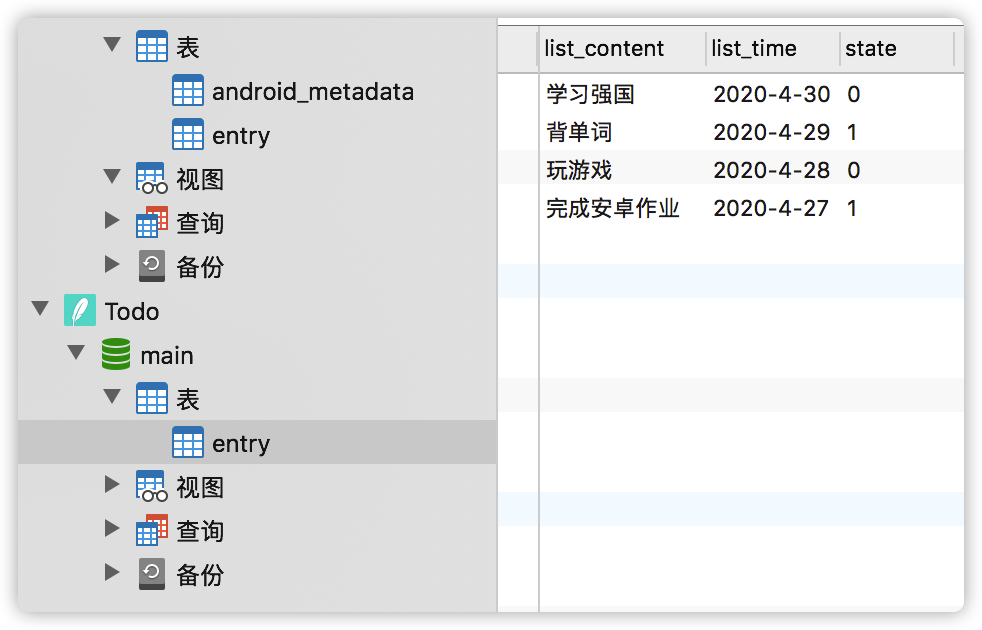

# todolist

## How to use

- Relesse下载app-debug.apk

- 对应目录下终端运行

  **adb install -t app-debug.apk**

  

##  数据库结构

| 列名            | 类型                 |
| --------------- | -------------------- |
| content（内容） | String               |
| time（时间）    | String               |
| State(状态)     | String("0"  /  "1"） |
| _ID             |                      |


## 使用Navicat查看数据库内容



## TODO 查询功能

```java
private List<Note> loadNotesFromDatabase() {
        // TODO 从数据库中查询数据，并转换成 JavaBeans
        SQLiteDatabase db = dbHelper.getWritableDatabase();

        String[] projection = {
                BaseColumns._ID,
                TodoContract.TodoEntry.LIST_CONTENT,
                TodoContract.TodoEntry.LIST_TIME,
                TodoContract.TodoEntry.List_STATE
        };

        //String selection = TodoContract.TodoEntry.LIST_CONTENT + " = ?";
        //String[] selectionArgs = {"my_title"};
        String od = TodoContract.TodoEntry.LIST_TIME + " DESC";
        Cursor c = db.query(
                TodoContract.TodoEntry.TABLE_NAME,
                null,
                null,
                null,
                null,
                null,
                od
        );
        Log.i("de", "perfrom query data:");
        List<Note> notes = new ArrayList<>();
        while(c.moveToNext()){
            long id = c.getLong(c.getColumnIndexOrThrow(TodoContract.TodoEntry._ID));
            String content = c.getString(c.getColumnIndex(TodoContract.TodoEntry.LIST_CONTENT));
            String timeStr = c.getString(c.getColumnIndex(TodoContract.TodoEntry.LIST_TIME));
            int state = c.getInt(c.getColumnIndex(TodoContract.TodoEntry.List_STATE));
            //转换格式
            SimpleDateFormat formatter = new SimpleDateFormat("EEE, d MMM yyyy HH:mm:ss");
            ParsePosition pos = new ParsePosition(0);
            Date time = formatter.parse(timeStr,pos);
            Note tmpNote = new Note(id);
            tmpNote.setContent(content);
            tmpNote.setDate(time);
            tmpNote.setState(State.TODO);
            notes.add(tmpNote);
        }
        c.close();
        return notes;
    }
```

## TODO 删除数据

```java
private void deleteNote(Note note) {
        // TODO 删除数据
        SQLiteDatabase db = dbHelper.getWritableDatabase();
        // Define 'where' part of query.
        String selection = TodoContract.TodoEntry.LIST_TIME+ " LIKE ?";
        // Specify arguments in placeholder order.
        SimpleDateFormat formatter = new SimpleDateFormat("EEE, d MMM yyyy HH:mm:ss", Locale.ENGLISH);
        String timeStr = formatter.format(note.getDate());
        String[] selectionArgs = {timeStr};
        // Issue SQL statement.
        int deletedRows = db.delete(TodoContract.TodoEntry.TABLE_NAME, selection, selectionArgs);

        notesAdapter.refresh(loadNotesFromDatabase());//更新数据

    }
```

## TODO 更新数据

```java
private void updateNode(Note note) {
        // TODO 更新数据
        SQLiteDatabase db = dbHelper.getWritableDatabase();
        ContentValues values = new ContentValues();
        String s;
        if(note.getState() == State.DONE)
            s = "0";
        else
            s = "1";

        values.put(TodoContract.TodoEntry.List_STATE, s);
        // Which row to update, based on the title
        SimpleDateFormat formatter = new SimpleDateFormat("EEE, d MMM yyyy HH:mm:ss", Locale.ENGLISH);
        String timeStr = formatter.format(note.getDate());
        String selection = TodoContract.TodoEntry.LIST_TIME + " LIKE ?";
        String[] selectionArgs = {timeStr};
        int count = db.update(
                TodoContract.TodoEntry.TABLE_NAME,
                values,
                selection,
                selectionArgs);

        notesAdapter.refresh(loadNotesFromDatabase());//更新数据
    }

```


## TODO 插入数据

```java
private boolean saveNote2Database(String content) {
        // TODO 插入一条新数据，返回是否插入成功
        SQLiteDatabase db = dbHelper.getWritableDatabase();
        ContentValues values = new ContentValues();
        //添加时间
        SimpleDateFormat formatter = new SimpleDateFormat("EEE, d MMM yyyy HH:mm:ss", Locale.ENGLISH);
        String timeStr = formatter.format(new Date(System.currentTimeMillis()));
        Log.d("currentTime", timeStr);
        //插入数据
        values.put(TodoContract.TodoEntry.LIST_CONTENT, content);
        values.put(TodoContract.TodoEntry.LIST_TIME, timeStr);
        values.put(TodoContract.TodoEntry.List_STATE,"0");
        long newRowId = db.insert(TodoContract.TodoEntry.TABLE_NAME, null, values);
        if(newRowId == -1){
            return false;
        }
        else{
            return true;
        }

    }
```


## TODO 定义表结构和 SQL 语句常量

```java
public final class TodoContract {

    // TODO 定义表结构和 SQL 语句常量
    //创建表格
    public static class TodoEntry implements BaseColumns{
        public static final String TABLE_NAME = "entry";
        public static final String LIST_CONTENT = "list_content";
        public static final String LIST_TIME = "list_time";
        public static final String List_STATE = "state";
    }

    //删除表格
    public static final String SQL_DELETE_ENTRIES = "DROP TABLE IF EXISTS " + TodoEntry.TABLE_NAME;


    public static  final String SQL_CREATE_ENTRIES =
            "CREATE TABLE " + TodoEntry.TABLE_NAME + " (" +
                    TodoEntry._ID + " INTEGER PRIMARY KEY," +
                    TodoEntry.LIST_CONTENT + " TEXT" +
                    TodoEntry.LIST_TIME + " TEXT," +
                    TodoEntry.List_STATE + " TEXT)";
    private TodoContract() {
    }

}
```


## TODO 定义数据库名、版本；创建数据库

```java
public class TodoDbHelper extends SQLiteOpenHelper {

    // TODO 定义数据库名、版本；创建数据库
    public static final int DATABASE_VERSION = 1;
    public static final String DATABASE_NAME = "Todo.db";
    public TodoDbHelper(Context context) {
        super(context, DATABASE_NAME, null, DATABASE_VERSION);
    }

    @Override
    public void onCreate(SQLiteDatabase db) {
        db.execSQL(SQL_CREATE_ENTRIES);
        db.execSQL("create table lm(man int, l text)");
    }

    @Override
    public void onUpgrade(SQLiteDatabase db, int oldVersion, int newVersion) {
        db.execSQL(SQL_DELETE_ENTRIES);
        onCreate(db);
        if (oldVersion == 1 && newVersion == 2) {
            db.execSQL("");
        }
    }

}
```

